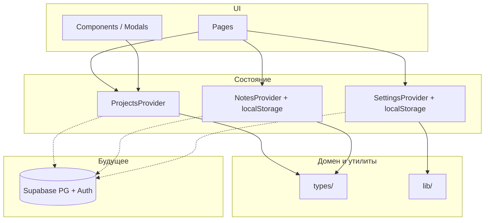
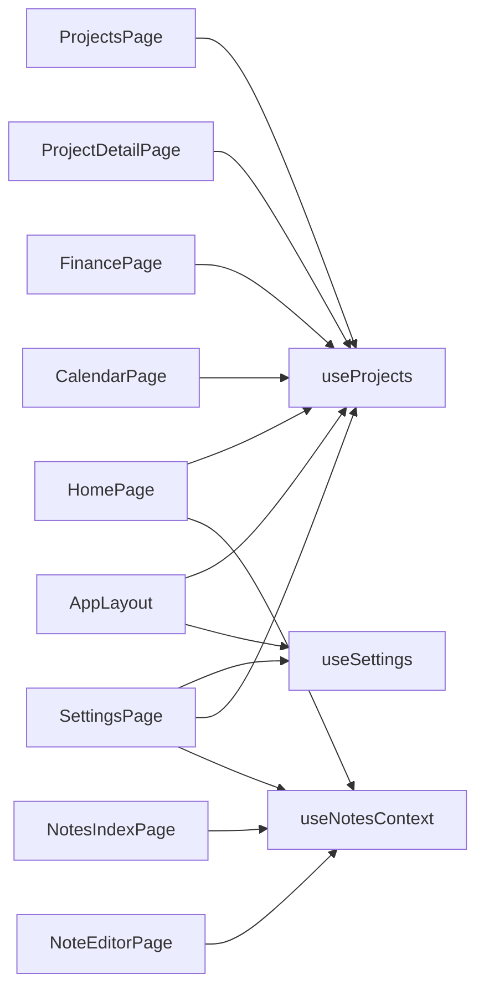

# Архитектура приложения

SPA на **React 19**, **Vite 8**, **TypeScript**, **Tailwind CSS v4**, маршрутизация **React Router v7**. Данные домена сейчас в основном **в памяти и localStorage**; схема **PostgreSQL в Supabase** подготовлена для будущей синхронизации с **Supabase Auth** и RLS.

## Обзор слоёв

## Маршруты (`App.tsx`)

| Путь | Страница | Данные |
|------|-----------|--------|
| `/` | `HomePage` | проекты, календарь, финансы (агрегации) |
| `/projects`, `/projects/:slug` | список / карточка проекта | `ProjectsProvider` |
| `/finance` | `FinancePage` | проекты + `financeTransactions` |
| `/calendar` | `CalendarPage` | проекты + `calendarCustomEvents` |
| `/notes`, `/notes/:noteSlug` | заметки / редактор | `NotesProvider` |
| `/settings` | `SettingsPage` | `SettingsProvider`, экспорт CSV, SQL |

Общая оболочка: **`AppLayout`** (шапка, навигация, таймер суммарного времени по этапам).

## Провайдеры (`main.tsx`)

Порядок вложенности:

1. **`SettingsProvider`** — профиль, UI (шрифт, акцент), поля Supabase URL/anon key; персист в `localStorage` (`portfolio-settings-v1`); выставляет CSS-переменные на `document.documentElement`.
2. **`ProjectsProvider`** — проекты, этапы, транзакции, кастомные события календаря, глобальный таймер этапа; **без персиста** (после перезагрузки списки сбрасываются).
3. **`NotesProvider`** — заметки; персист `portfolio-notes-v1`.

## Доменные типы (`src/types/`)

- **`project`**, **`projectForm`**, **`stageForm`** — проекты и этапы (в т.ч. чеклист, `timeSpentSeconds`).
- **`financeTransaction`** — доход/расход в рублях.
- **`calendarCustomEvent`** — событие с `dateRaw` (ДД.ММ.ГГГГ).
- **`note`** — заметка с массивом блоков (`NoteBlock`), вложения к проектам по `slug`.
- **`settings`** — поля настроек приложения.

## Вспомогательные модули (`src/lib/`)

Парсинг дат/сумм, slug, экспорт **CSV** (`exportPortfolioCsv`), контраст текста к акценту (`pickContrastText`), данные по умолчанию для этапов и т.д.

## База данных (Supabase)

- Миграции в **`supabase/migrations/`** — выполняйте **`001_…sql`–`009_…sql`** по порядку. На экране регистрации и в настройках можно скопировать **объединённый** скрипт (см. `src/lib/portfolioSchemaSql.ts`).
- **`001_portfolio_schema.sql`** — базовые таблицы `profiles`, `projects`, `project_stages`, `finance_transactions`, `calendar_custom_events`, `notes`, триггеры (профиль при регистрации, `updated_at`), **RLS** по `auth.uid()`; последующие файлы расширяют профиль, рабочее пространство, Telegram, задачи.
- Связь этапов с пользователем — через `projects.user_id`.
- Ключи API не хранятся в таблицах; anon key только на клиенте (или в секретах CI).

## Сборка и стили

- **Vite** собирает клиент; **Tailwind** через `@import 'tailwindcss'` и `@theme` в `index.css`.
- Шрифты: Google Fonts (Inter, JetBrains Mono) в `index.html`.

## Зависимости между страницами и контекстом

Этот документ можно дополнять по мере появления реального клиента `@supabase/supabase-js` и синхронизации с БД.
